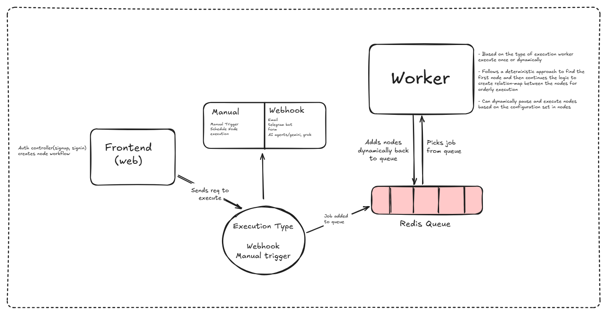
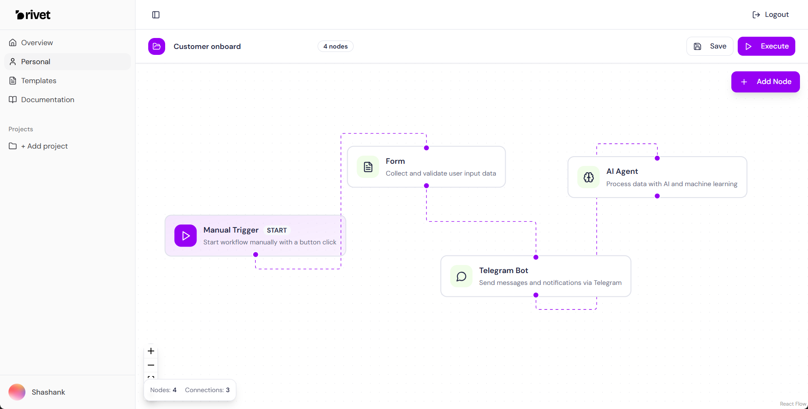

# RIVET 
*A modern workflow automation tool – inspired by [n8n](https://n8n.io/)*

rivet is an open-source workflow automation platform that lets your connect APIs, services, and applications together with ease.  
It enables developers and teams to **build, automate, and scale workflows** using a simple visual interface and powerful backend engine..

---

##  Features

- **Node-based workflow builder** – visually create and connect nodes.  
- **Event-driven automation** – trigger workflows via HTTP, cron jobs, or webhooks.  
- **Custom integrations** – extend with your own nodes and APIs.  
- **Real-time execution logs** – debug and monitor workflow runs.  
- **REST API support** – manage workflows programmatically.  
- **Database support** – persists workflows, executions, and users. 
- **Pluggable architecture** – easy to extend and customize.

---

## System architecture


## Getting Started

### Prerequisites
- **Node.js** (>= 20)  
- **pnpm** or **npm/yarn**  
- **PostgreSQL / SQLite / MySQL** (for persistent data)  

## Live Preview


### Installation

Clone the repository:

```bash
git clone https://github.com/shashank-poola/rivet.git
cd rivet

bun install

bun run dev

```bash
